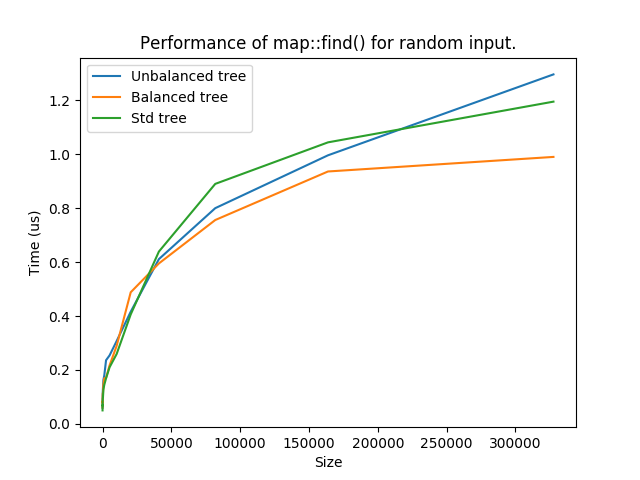
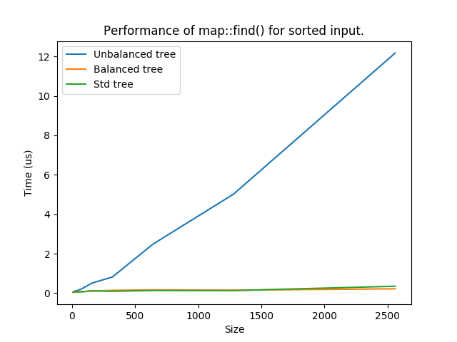

# C++ part

This directory contains the implementation of a class named `map`
with similar functionality to `std::map`.
The former is templated over the types of the key and the value 
to store.

Unlike `std::map`, the current `map` is structed as a binary tree
which it not necessarily balanced. Random ordered input keys
inserted in an initially empty `map` makes it to become
almost balanced, while ordered inputs will make the instance to 
store data in a single branched tree.

The following plots show the time per `find()` request on `map`
before and after balancing and `std::map`, for random and sorted
input.

